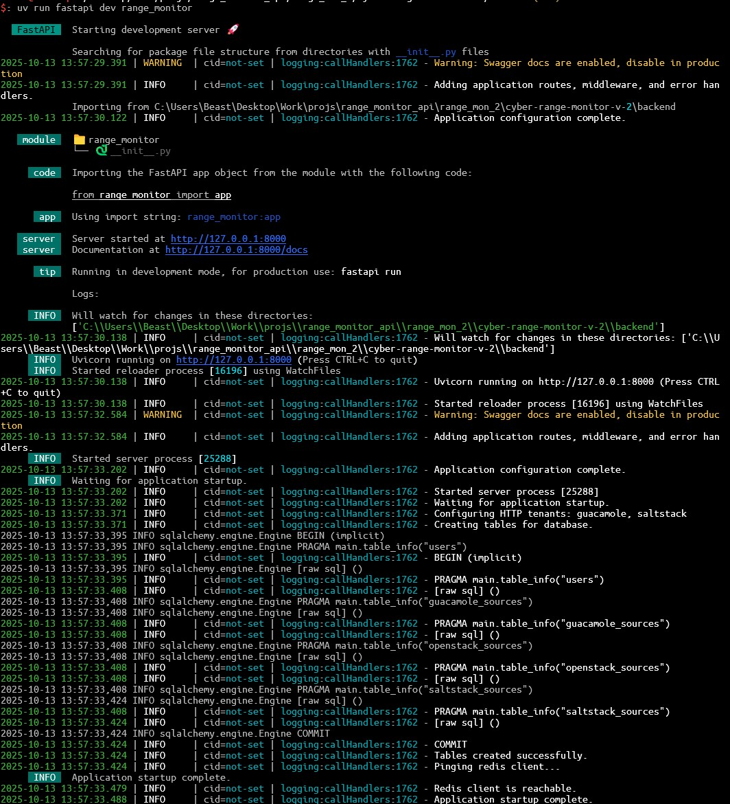
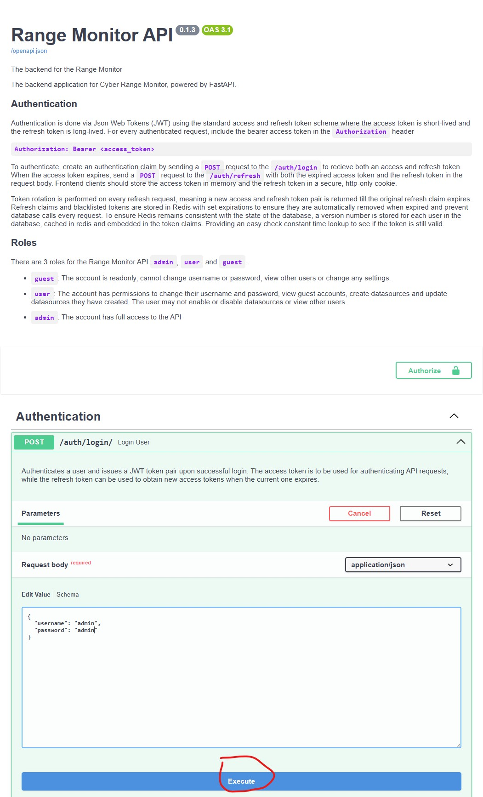
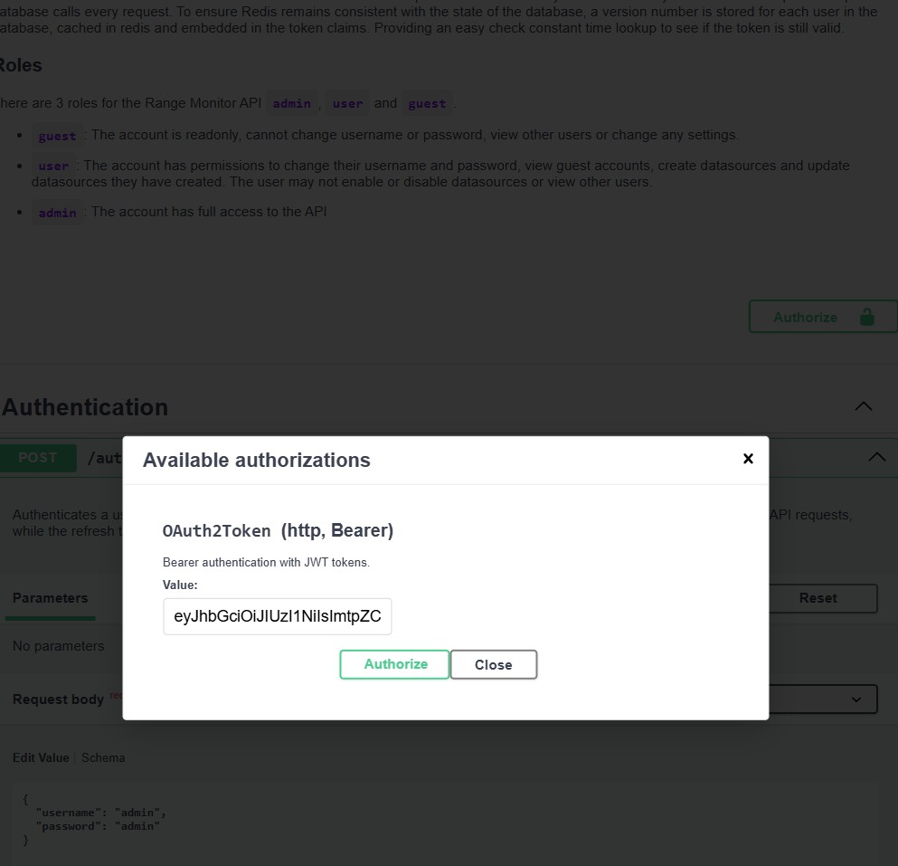

# Range Monitor v2 (Backend)

The Range Monitor v2 uses FastAPI on the backend and UV to manage dependencies and the pyproject.toml file for specifying and managing project dependencies. Additionally, for Authentication the backend relies on api keys that are managed by Redis and are stateless client side.

## Tools & Technologies

**UV**:

**FastAPI**: FastAPI is a modern, fast (high-performance), web framework for building APIs with Python 3.6+ based on standard Python type hints and uvicorn is the runtime for the ASGI server.

**SQLite**: The backend uses SQLAlchemy as the Object Relational Mapper (ORM) with SQLite as the underlying database
  used due to it's simplicity.

**Redis** Redis is used to manage JWT tokens and caching for the application.


## Getting Started

Run the following commands to get started:

```bash
uv sync # Install dependencies
uv run scripts/create_env.py # Create .env file with secrets
uv run fastapi dev range_monitor
```

**Example Output**




From here, you can navigate to `http://localhost:8000/docs` to view the interactive API documentation provided by FastAPI. The database
should've been automatically created in the `sqlite/` directory and a seed of users should be present with the usernames and passwords where
you can then authenticate using the `/auth/login` endpoint to receive a JWT token to authenticate with the other endpoints.

Login and copy the access token from the response



**Example Response**

Copy the accessToken field from the response

```json
{
  "claim": {
    "accessToken": "foo", // <-- Copy this
    "refreshToken": "bar",
    "tokenType": "bearer",
    "expiresAt": "2025-10-14T14:02:03",
    "issuedAt": 1760378523
  },
  "userId": "ebc829d6-2f20-4212-89a9-045449622291",
  "username": "admin",
  "role": "admin"
}
```
Then click the Authorize button in the top right of the docs page and enter `Bearer <token>` where `<token>` is the access token you received



Then make sure your authenticated by sending a request to the `/auth/token` route. Note: make sure you pasted it properly


### Prerequisites

**UV**: The package manager for managing dependencies, virtual environments and running scripts. Due to it automatically managing dev dependencies,
I suggest using it and the setup is simple, just follow the instructions on the [UV GitHub](https://docs.astral.sh/uv/getting-started/installation/)

**Redis**: If your running this locally and are on windows, you must use WSL since Redis isn't natively supported.
You can also use docker if you prefer, but for development I reccomend using WSL. To install Redis on WSL, follow the instructions below:

```bash
# Install Redis on Linux
sudo apt update && sudo apt-get install redis-server
sudo service redis-server start
# Test Redis
redis-cli
ping
# Should see pong
```

**SQLite**: SQLite is a file based database, so no setup is required. The database file will be created in the `sqlite/` directory when the application is first run
to view the database, you can use a GUI such as DB Browser for SQLite or the command line.

## Summary

```plaintext
backend/
|
|___ sqlite/ (...)
|
|____ config.toml
|
|____ .env
|
|___ logs/ (...)
|
|____ range_monitor/ (...)
      |
      |___ core /
      |    | (....)
      |
      |__ infa /
      |    | (....)
      |
      |___ middleware /
      |    | (....)
      |
      |___ auth /
      |    | (....)
      |
      |___ users /
      |    | (....)
      |
      |___ sources /
      |    | (....)
      |
      |___ guac /
      |    | (....)
      |
      |___ utils /
      |     | (....)
      |
```

## Configurations
For configurations, use the `config.toml` file to configure static, non-sensitive settings and the `.env` file to configure sensitive settings such as
secrets. To generate secrets for development, run `uv run scripts\create_env.py` which will create a .env file with random secrets. The `config.toml`
file is ordered such that it is loaded in the hierarchy of the `AppSettings` class in `range_monitor.config`.

### Structure

#### Services
The project is structured such that each endpoint is it's own package with the core functionality of the application with common files describing the structure below.

```plaintext
service_name/
|
|____ models.py # Database model definitions (if any)
|
|____ schema.py # Pydantic models for request/response validation
|
|____ service.py # Business logic for the endpoint, expand to directory if needed
|
|____ router.py # FastAPI Router definition and endpoints
|
|____ depends.py # FastAPI Depenedencies for the endpoint

```

Following this structure allows for easy expansion of the endpoint as needed and prevents circular imports from occuring.

### Infrastructure

The infra directory contains the infrastructure for the application such as the database, redis client and other essential infrastructure for the application such as logging and security. Generally speaking, if it's created in the application lifespan once, it should go here and added to the lifespan. Do not use globals, uvicorn runs the app in multiple workers and globals will not be shared between workers. A good practice is to wrap any
infrastructure class where possible in a class with methods to setup and teardown the infrastructure to manage the lifecycle and encapsulate the finer
details. To see how the ASGI lifespan works and whats available on each request, view `range_monitor.lifespan`.

#### SQLite & SQLAlchemy

The database file for SQLite is in the `sqlite/` directory and constants define the file names, you can configure behavior such as the pragmas
and the pooling in the config.toml; one important note is that AsyncSessions should be used per request and not shared between multiple if you do
buggy behavior may occur, but if you don't change the default behavior you will be fine.

The app is designed to run a seed for users of all different role types on startup if the database file doesn't exist, this behavior in the future
should be changed to not occur in production environments since the usernames and passwords are the role names.

##### Why Migrations Aren't Used

Since the application is relatively simple and uses SQLite, migrations using alembic are not implemented. If the tables change frequently, it may be worth
implementing alembic migrations, but for now the database is simple enough to not require them.

#### Redis

Redis is used for caching and token storage, the redis client is setup in the infra directory and is connected to in the lifespan of the application.


### Core

This directory should contain functionality the entire application depends on and default behavior such as errors, schemas and config classes. It shouldn't
need to be expanded further at this point.

### Utils

This is for decorators, helpers and other utility functions that are used throughout the application that dont fit in the service package style that have functions
applicable and reusable for multiple services.

## Routes & Services


### Authentication

Authentication is done using JWT tokens with API keys stored in Redis. The tokens are stateless and contain the user id, username and role of the user. Storing the user id, cver (credential version) and role in the token allows for easy verification of the user's identity and permissions without needing to query the database on each request.

Access tokens are short lived (15 minutes) and refresh tokens are long lived (1 day) by default, but these can be configured in the config.toml file. The refresh tokens are stored in Redis with a TTL of 1 days and are used to generate new access tokens when they expire. If a user logs out, the refresh token is deleted from Redis, effectively revoking the user's access.

When the credential version of the user is incremented (when password or role changes), all existing tokens for that user become invalid since the cver in the token will no longer match the cver in the database. This ensures that if a user's credentials are compromised, they can be changed and all existing tokens will be invalidated.


### Users

Basic CRUD operations with Role Based Access Controls, filtering and pagination. Passwords are stored as hashes

### Data sources

The range monitor primarily serves as a read-only way to manage and view the state of our infrastructure. The adapters are basically the implementation for how to
connect inside of the application. The passwords for each datasource should be encrypted at rest

#### HTTP Adapters
For both saltstack and guacamole, (as of writing this) the adapters are for `httpx.AsyncClient` and http connections managed by
the HttpTenantPool which is a connection manager for the connected (or enabled) datasources. Due to the limited amount of users, only one connection per datasource
should be maintained and good defaults for SSL, metrics and visibility have been implemented.

Each HTTP adapter defines it's own `AuthScheme` which is a abstract base class defining how to authenticate and send a token with each request.


#### Openstack

Openstack is a unique case since the SDK is synchronous and has it's own connection management. The Openstack adapter is seperate from the Http adapters for this
reason and is implemented as a singleton added to the lifespan. It has not been implemented yet, but when you do ensure that you use the `@asyncify` decorator or
run it in a threadpool to avoid blocking the event loop.